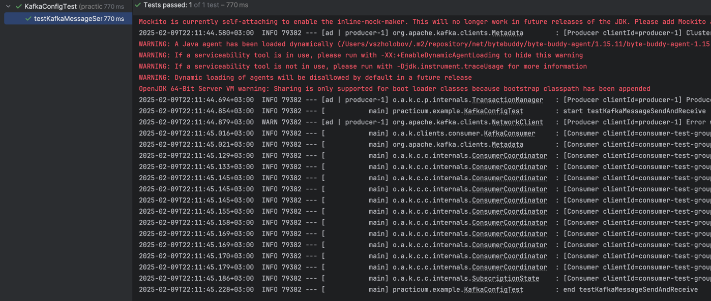
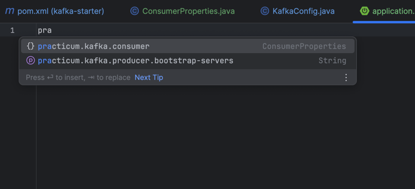
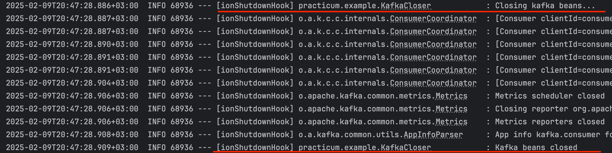

# Стартер для создания consumer и producer для kafka

## Структура
Проект состоит из:
1) [стартер](./starter) - создает producer и consumer, если указаны нужные свойства 
2) [пример consumer](./consumer-example) - считывает сообщения из kafka раз в 5 секунд
3) [пример producer](./producer-example) - отправляет сообщение в kafka при вызове http ручки

## Фичи
Написан интеграционный тест с использованием testcontainers, который поднимает kafka в Docker, отправляет туда сообщение и считывает его оттуда

Реализовано автодополнение свойств стартера:

Реализовано закрытие бинов consumer и producer при отключении приложения:

